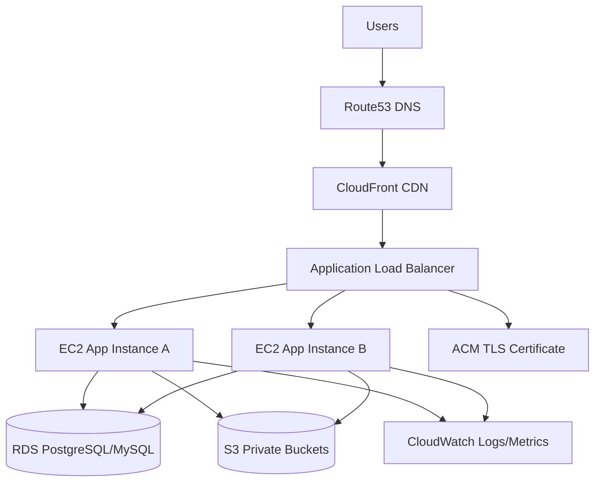

# AWS Deployment Guide

This guide describes a production-ready AWS deployment path for Sihati using EC2, RDS, S3, CloudFront, Route53, an Application Load Balancer, HTTPS, backups, monitoring, and operational safeguards.

## 1. Recommended AWS architecture



Minimum production topology:

- Route53 hosted zone for the domain.
- ACM certificate for HTTPS.
- CloudFront for caching/static acceleration and edge TLS.
- Application Load Balancer for HTTPS termination and health checks.
- Two EC2 instances across different Availability Zones for high availability.
- RDS PostgreSQL as the recommended database.
- S3 for private assets, backups, logs, and future document storage.
- CloudWatch for logs, metrics, alarms, and dashboards.

## 2. EC2 deployment

### Instance baseline

Recommended starting point:

- Amazon Linux 2023 or Ubuntu LTS.
- Instance type: `t3.small` or larger for staging, `t3.medium` or larger for production depending on traffic.
- EBS gp3 volume with encryption enabled.
- IAM role with least-privilege access to required S3 buckets, CloudWatch logs, and parameter/secrets stores.

### Runtime setup

Install:

- Node.js 22 LTS.
- npm 10+.
- Git or deployment artifact tooling.
- Process manager such as systemd or PM2.
- CloudWatch agent.

Deployment commands for an artifact-based release:

```bash
npm ci
npx prisma generate
npx prisma migrate deploy
npm run build
npm run start
```

For long-running production processes, prefer systemd or a container orchestrator over manual shell sessions.

### EC2 security

- Do not expose port 3000 directly to the internet.
- Allow inbound app traffic only from the ALB security group.
- Use AWS Systems Manager Session Manager instead of public SSH when possible.
- If SSH is unavoidable, restrict it to a trusted IP range and use key-based auth.
- Enable automatic OS security updates or establish a patch window.
- Store secrets in AWS Secrets Manager or SSM Parameter Store, not on disk in plain text.

## 3. S3 usage

Recommended buckets:

- `sihati-prod-private-assets` for future private uploads/documents.
- `sihati-prod-backups` for exported backups and operational snapshots.
- `sihati-prod-logs` for ALB/CloudFront logs if enabled.

Security requirements:

- Block public access by default.
- Enable default encryption with SSE-S3 or SSE-KMS.
- Enable bucket versioning for important buckets.
- Use lifecycle policies to move old logs/backups to lower-cost storage.
- Access private files through signed URLs or backend streaming only.

## 4. CloudFront

CloudFront can sit in front of the ALB for global TLS, caching, compression, and edge protection.

Recommended settings:

- Origin: Application Load Balancer DNS name.
- Viewer protocol policy: redirect HTTP to HTTPS.
- Allowed methods: `GET, HEAD, OPTIONS, PUT, POST, PATCH, DELETE` if forwarding API traffic through CloudFront.
- Cache static assets aggressively.
- Disable caching for authenticated pages and API routes unless cache keys are carefully configured.
- Forward required headers and cookies for dynamic routes.
- Enable standard logs if required for operations.

## 5. RDS PostgreSQL or MySQL

PostgreSQL is the current Prisma datasource and recommended production database.

RDS baseline:

- Engine: PostgreSQL 16+ recommended.
- Multi-AZ enabled for production.
- Storage encryption enabled.
- Automated backups enabled.
- Deletion protection enabled.
- Private subnets only.
- Security group allows inbound database traffic only from the app security group.

Connection string example:

```env
DATABASE_URL=postgresql://sihati_app:<password>@<rds-endpoint>:5432/sihati?schema=public
```

If choosing MySQL, update Prisma datasource provider, validate schema compatibility, generate migrations, and run a full test suite before deployment. MySQL is not a drop-in switch for the current checked-in Prisma datasource.

## 6. Route53

DNS setup:

1. Create or use a hosted zone for the domain.
2. Create an ACM certificate in the required region.
3. Add validation records to Route53.
4. Point `app.example.com` or the apex domain to CloudFront with an alias record.
5. Optionally route `api.example.com` separately if API and frontend are split later.

Recommended records:

- `A`/`AAAA` alias to CloudFront distribution.
- `CAA` records to restrict certificate authorities if required.
- MX/TXT records for verified email provider domains.

## 7. Load Balancer

Application Load Balancer settings:

- Listener 80: redirect to HTTPS 443.
- Listener 443: ACM certificate.
- Target group protocol: HTTP to EC2 app port.
- Health check path: a stable lightweight route, for example `/api/practitioners/search` with safe query defaults or a dedicated health route when implemented.
- Deregistration delay configured for graceful deployments.

Security groups:

- ALB inbound: 80/443 from internet.
- ALB outbound: app target port to EC2 app security group.
- EC2 inbound: app port only from ALB security group.

## 8. SSL/HTTPS

- Use ACM-managed certificates.
- Redirect all HTTP traffic to HTTPS.
- Set `NEXT_PUBLIC_APP_URL` to the HTTPS canonical domain.
- Mark production cookies `Secure`, `HttpOnly`, and `SameSite` when production sessions are implemented.
- Verify webhook endpoints use HTTPS URLs in provider dashboards.

## 9. Domain DNS configuration

Deployment domain checklist:

- [ ] Domain hosted in Route53 or delegated correctly.
- [ ] ACM certificate validated.
- [ ] CloudFront alternate domain name configured.
- [ ] Alias record points to CloudFront.
- [ ] `NEXT_PUBLIC_APP_URL=https://your-domain`.
- [ ] OAuth/Firebase authorized domains include production and staging domains.
- [ ] Stripe webhook endpoint points to the production HTTPS URL.

## 10. Environment variables

Store production values in Secrets Manager, SSM Parameter Store, or the deployment orchestrator secret store.

Required production variables from current runtime validation:

```env
NEXT_PUBLIC_APP_URL=https://your-domain.example
NODE_ENV=production
DATABASE_URL=postgresql://...
AUTH_SECRET=<at-least-32-characters>
APP_ENCRYPTION_KEY=<base64-32-byte-key>
STRIPE_SECRET_KEY=sk_live_...
STRIPE_WEBHOOK_SECRET=whsec_...
EMAIL_FROM=noreply@your-domain.example
RESEND_API_KEY=...
```

Potential Firebase variables when Firebase Auth is implemented:

```env
NEXT_PUBLIC_FIREBASE_API_KEY=
NEXT_PUBLIC_FIREBASE_AUTH_DOMAIN=
NEXT_PUBLIC_FIREBASE_PROJECT_ID=
NEXT_PUBLIC_FIREBASE_APP_ID=
FIREBASE_PROJECT_ID=
FIREBASE_CLIENT_EMAIL=
FIREBASE_PRIVATE_KEY=
```

## 11. Server security

- Run the app as a non-root user.
- Keep EC2 instances in private subnets where possible.
- Apply least-privilege IAM roles.
- Enable EBS encryption.
- Enable CloudTrail for account auditing.
- Configure AWS WAF for CloudFront/ALB if exposed publicly.
- Replace in-memory rate limiting with Redis/Upstash/WAF rate limits for multi-instance deployments.
- Rotate secrets and access keys on a schedule.
- Never log PHI, passwords, payment data, private keys, or decrypted service configuration secrets.

## 12. Backups

Database backups:

- Enable RDS automated backups with a retention period aligned to business requirements.
- Enable point-in-time recovery.
- Take manual snapshots before major migrations.
- Test restore procedures regularly.

S3 backups:

- Enable versioning on critical buckets.
- Use lifecycle retention policies.
- Replicate to another region if required by business continuity plans.

Application backups:

- Keep release artifacts reproducible from Git tags and lockfiles.
- Back up operational configuration that is not otherwise reproducible.

## 13. Monitoring

CloudWatch monitoring:

- Application logs.
- ALB 4xx/5xx counts.
- Target response time.
- EC2 CPU/memory/disk.
- RDS CPU/connections/storage/replication lag if replicas are used.
- CloudFront error rates.

Recommended alarms:

- High 5xx rate.
- High latency.
- EC2 unhealthy target count.
- RDS free storage low.
- RDS CPU or connections high.
- Failed deployment health checks.

## 14. Deployment checklist

Pre-deploy:

- [ ] Release branch reviewed and merged.
- [ ] `npm ci` succeeds.
- [ ] `npm run check` succeeds.
- [ ] `npm run build` succeeds.
- [ ] Prisma migrations reviewed.
- [ ] Production secrets exist and are not committed.
- [ ] RDS snapshot taken before schema migration.

Deploy:

- [ ] Pull or upload release artifact.
- [ ] Install dependencies with `npm ci`.
- [ ] Run `npx prisma generate`.
- [ ] Run `npx prisma migrate deploy`.
- [ ] Build with `npm run build`.
- [ ] Restart app process gracefully.
- [ ] Verify ALB target health.

Post-deploy:

- [ ] Open production domain over HTTPS.
- [ ] Run public search smoke test.
- [ ] Run protected auth smoke tests with production auth provider.
- [ ] Run admin service configuration smoke test.
- [ ] Confirm logs do not contain secrets.
- [ ] Confirm error rate and latency are normal.
