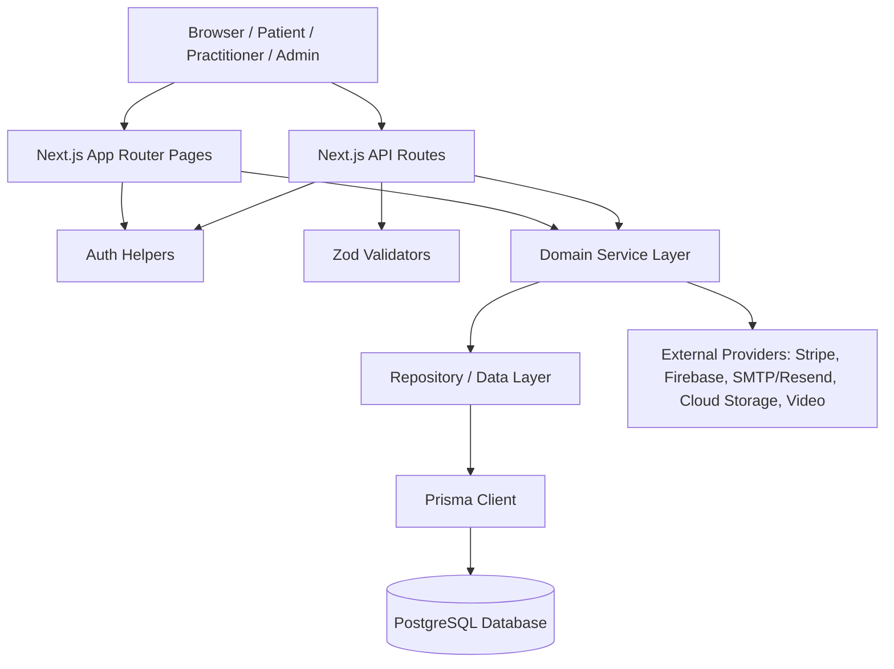
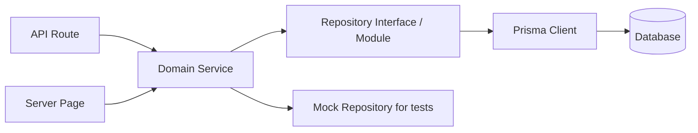
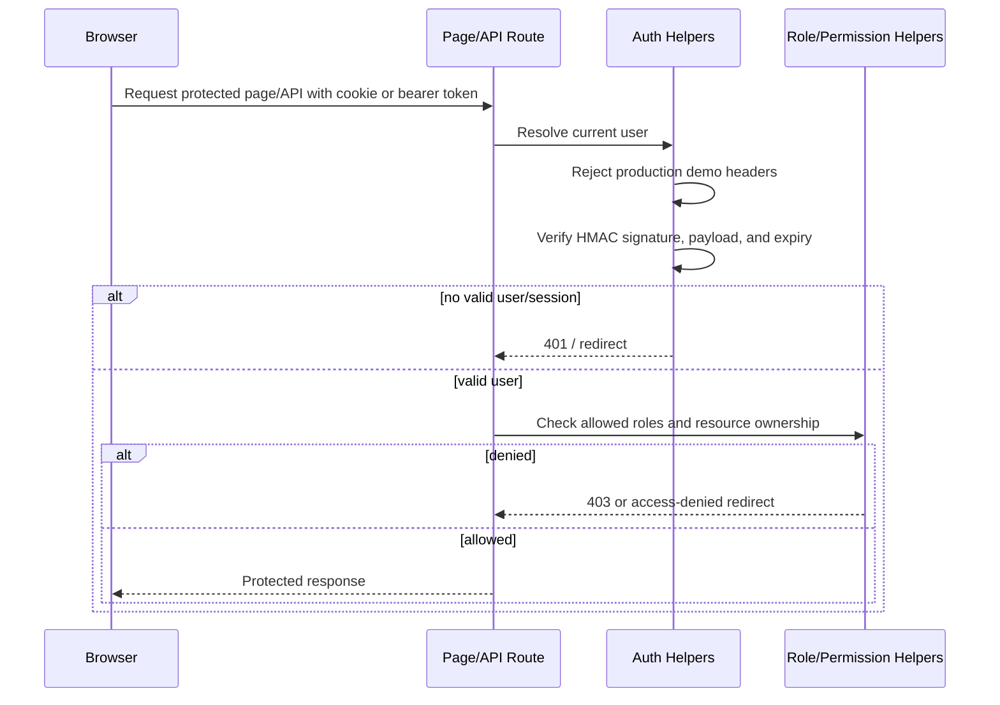
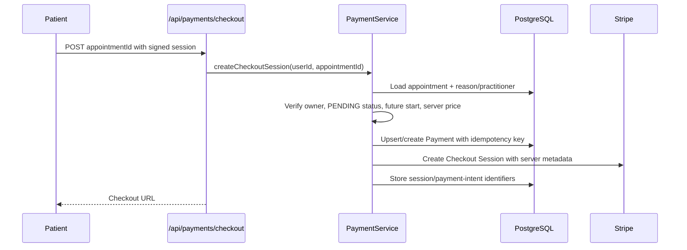
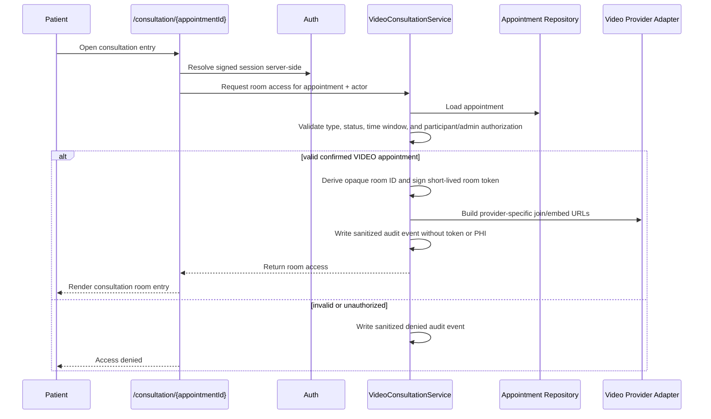
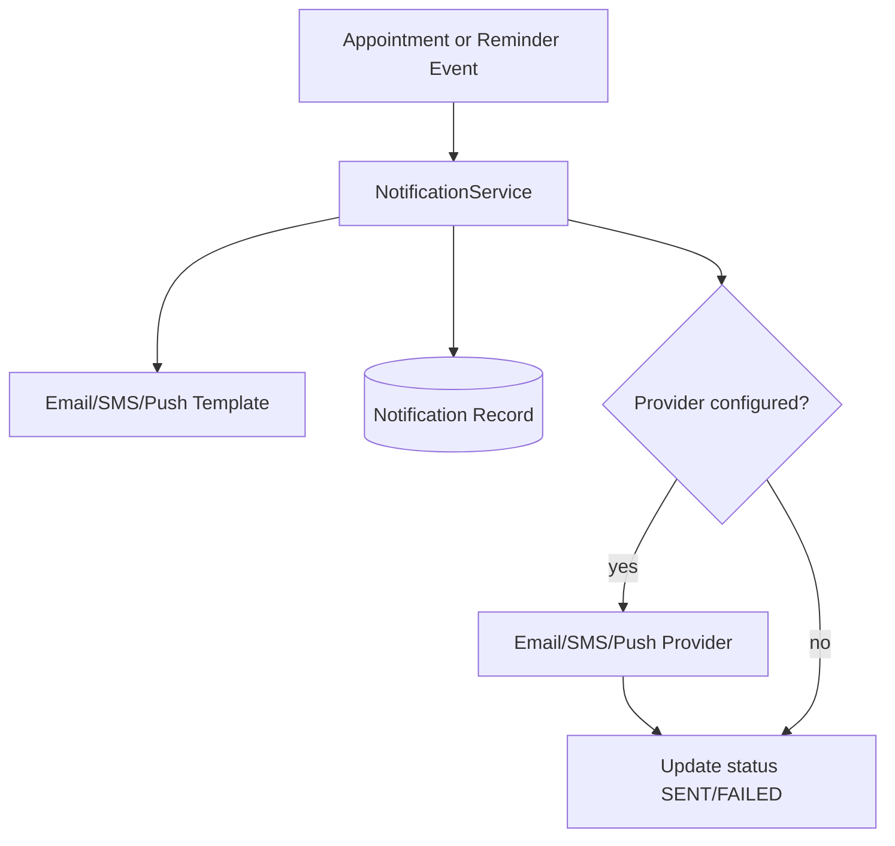
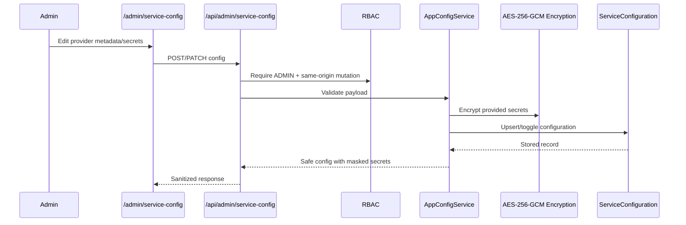
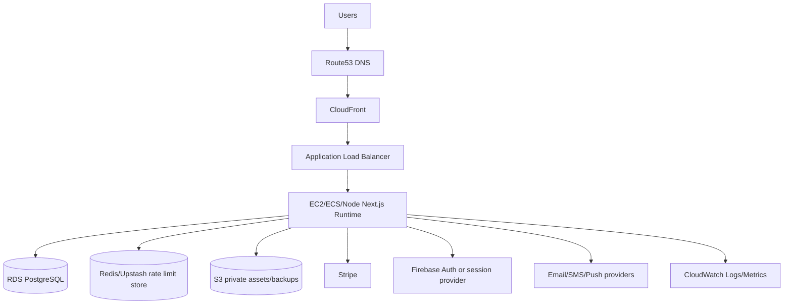

# Sihati Technical Architecture

Sihati is a Next.js and TypeScript medical appointment booking platform for patient booking, practitioner availability, admin configuration, payments, notifications, and video consultation entry points. This document describes the production-oriented architecture, the target operating model, and the boundaries that must be preserved during stabilization. It does not mark placeholder or unvalidated flows as approved for live traffic.

## Production readiness status

Sihati is production-oriented, but it is **not yet approved for live production traffic**. The codebase has a clear App Router structure, service/repository boundaries, PostgreSQL/Prisma data access, documented deployment targets, and security controls that are intended for production. Release approval still depends on replacing MVP placeholders, validating provider integrations, and proving the operational runbooks in a staging environment.

Treat this document as the architecture baseline for the next release hardening phase. A feature is production-ready only when the implementation, tests, environment configuration, monitoring, and rollback procedure are all complete.

### Release blockers

The following items must be closed before handling real patient traffic, real payments, or live medical documents:

- **Production authentication:** use a real production identity provider or signed-session implementation, disable demo identity headers, and verify server-side ownership on every protected resource. See [Authentication](authentication.md).
- **Shared rate limiting:** use a shared Redis/Upstash-compatible limiter for all production instances; in-memory limits are local/test only. See [Security](security.md).
- **Stripe checkout/webhook implementation:** complete and verify checkout creation, webhook signature validation, idempotency, payment state transitions, and tests before accepting real payments. See [Stripe payments](payments.md).
- **Medical document storage/access controls:** keep file bytes private, return only authorized short-lived links, audit access, and confirm patient/practitioner/admin policies before enabling uploads. See [Privacy](privacy.md).
- **Database-backed replacement of demo/sample data:** remove sample dashboard, success-page, and placeholder flows from production paths or back them with authorized database queries.
- **Prisma migration/backup/restore validation:** run migration deployment and restore drills against production-like data before release. See [Database production runbook](database-production-runbook.md).
- **Docker build validation in CI:** build the production image in CI when Docker deployment is used. See [Docker local deployment](docker.md).
- **E2E and staging smoke tests:** cover booking, auth, payments, medical documents, video entry, admin configuration, and rollback-critical paths before release. See [Testing](testing.md).

## 1. Global architecture

The application is a single Next.js App Router codebase that contains:

- Public and protected server-rendered pages under `app/`.
- API route handlers under `app/api/`.
- Domain services under `lib/services/`.
- Repository/data access modules under `lib/repositories/` and Prisma access through `lib/db/prisma.ts`.
- Security, auth, validation, and runtime configuration modules under `lib/`.
- Shared UI and layout components under `components/`.
- Prisma schema under `prisma/schema.prisma`; migration, backup, rollback, restore-test, and seed-data operations are defined in `docs/database-production-runbook.md`.
- Unit/API tests under `tests/`.



## 2. Frontend architecture

### App Router structure

- `app/page.tsx` is the public home entry point.
- `app/(public)/search/page.tsx` and `app/(public)/specialties/[specialty]/page.tsx` expose public discovery pages.
- `app/practitioners/[slug]/page.tsx` exposes practitioner profile pages.
- `app/booking/new/page.tsx` and `app/booking/new/BookingNewClient.tsx` support patient booking.
- `app/dashboard/patient/*`, `app/dashboard/practitioner/*`, and `app/dashboard/admin/*` are role-protected dashboard areas.
- `app/consultation/[appointmentId]/page.tsx` is the protected video consultation entry page.
- `app/access-denied/page.tsx` is the common authorization failure page.

### Component structure

- `components/layout/` contains global layout primitives such as header and footer.
- `components/ui/` contains reusable UI primitives.
- `components/search/`, `components/calendar/`, and `components/cards/` contain feature-specific presentation components.

### Frontend responsibilities

The frontend should remain focused on:

- Rendering pages and forms.
- Calling internal API routes.
- Displaying validation and access errors safely.
- Never embedding server-only secrets.
- Using only `NEXT_PUBLIC_*` environment variables in browser code.

## 3. Backend/API architecture

API handlers live in `app/api/**/route.ts` and use a consistent shape:

1. Apply authentication/authorization where needed.
2. Apply same-origin checks for browser-originating mutations.
3. Apply route-specific rate limits through `lib/security/rate-limit.ts`.
4. Parse query/body data through Zod validators.
5. Delegate business rules to services.
6. Return sanitized JSON through shared error helpers.

Current API routes include:

| Route | Status | Main responsibility |
| --- | --- | --- |
| `GET /api/practitioners/search` | Public | Search practitioners with validated filters and a safe public search rate limit. |
| `GET /api/practitioners/[id]/available-slots` | Public | Generate available appointment slots with a safe public lookup rate limit. |
| `POST /api/appointments` | Protected | Create appointments for authenticated patients with a medium per-user/IP creation limit. |
| `GET /api/medical-documents` | Protected placeholder | Reserved until storage rules are complete; guarded by strict per-user/IP limits. |
| `POST /api/payments/checkout` | Protected release blocker | Target route for creating Stripe Checkout Sessions for authenticated patient-owned pending appointments; must be fully implemented and verified before real payments. |
| `POST /api/stripe/webhook` | Provider release blocker | Target route for verifying Stripe signatures over the raw body and processing idempotent payment events; must be fully implemented and verified before real payments. |
| `GET/POST/PATCH /api/admin/service-config` | Admin only | Manage external service configuration records; mutations use a medium admin per-user/IP limit. |
| `GET /api/reviews` | Placeholder | Reserved for review data with public rate limiting. |

## 4. Service layer

The service layer owns business logic and keeps route handlers thin.

| Service | File | Responsibility |
| --- | --- | --- |
| `AppointmentService` | `lib/services/appointment.service.ts` | Appointment creation and appointment business rules. |
| `AvailabilityService` | `lib/services/availability.service.ts` | Availability rules, blocked dates, and slot generation. |
| `PractitionerSearchService` | `lib/services/practitioner-search.service.ts` | Practitioner search orchestration. |
| `NotificationService` | `lib/services/notification.service.ts` | Notification payload preparation and status handling. |
| `AppConfigService` | `lib/services/app-config.service.ts` | Admin-managed external provider configuration with encrypted secrets and masked previews. |
| `PaymentService` | `lib/services/payment.service.ts` | Stripe Checkout creation, appointment payment eligibility checks, verified webhook event transitions, and duplicate event handling. |
| `VideoConsultationService` | `lib/services/video-consultation.service.ts` | Server-side video room authorization, opaque room ID generation, short-lived room token signing, provider adapter handoff, and audit logging. |

Service design rules:

- Keep provider-specific code behind service boundaries.
- Keep validation schemas in `lib/validators/` and call them before service execution.
- Avoid direct database calls from UI components.
- Avoid direct environment variable reads outside `lib/env.ts`, `lib/config/app.ts`, and narrowly scoped provider adapters.

## 5. Repository/data layer

### Prisma

`prisma/schema.prisma` defines the core data model:

- Users and roles: `User`, `UserRole`.
- Practitioners and catalog data: `Practitioner`, `ConsultationReason`.
- Scheduling: `AvailabilityRule`, `BlockedDate`, `Appointment`, `ConsultationType`, `AppointmentStatus`.
- Notifications: `Notification`, notification channel/status/type enums.
- External configuration: `ServiceConfiguration`, `ExternalServiceProvider`.

The current Prisma datasource is PostgreSQL. Production deployments should use migrations (`prisma migrate deploy`) rather than `prisma db push`.

### Repositories

Repository modules under `lib/repositories/` isolate persistence access from service logic. Mock repositories under `lib/repositories/mock/` support deterministic tests and provider-free development.



## 6. Authentication flow

Current authentication boundary:

- Authentication helpers are centralized in `lib/auth/current-user.ts` and `lib/auth/session.ts`.
- Production authentication remains a release blocker until the selected provider or signed-session implementation is verified end to end in staging.
- The target signed-session path uses a `sihati_session` token verified with `AUTH_SECRET`; the same signed token may be supplied as `Authorization: Bearer <token>` for non-browser API clients if that path is approved.
- Demo headers (`x-user-id`, `x-user-role`) are local/test only and must be rejected in production.
- `NODE_ENV=production` must fail closed if required auth secrets are missing or too weak.
- Protected API handlers and server pages must resolve the user server-side; client-provided IDs are not trusted for authorization.



Production auth requirements:

- Keep all user resolution centralized in `lib/auth/session.ts` and `lib/auth/current-user.ts`.
- Reject spoofable identity headers in production.
- Validate tokens/cookies on the server with `AUTH_SECRET`.
- Store only minimal session data in cookies: user ID, role, issued-at, and expiry.
- Re-check ownership server-side for appointment creation/access, consultation access, medical documents, and admin service configuration.
- Preserve same-origin checks on browser-initiated state-changing routes.


## 7. Shared rate limiting

Sihati centralizes route limits in `lib/security/rate-limit.ts`. The limiter exposes one API for route handlers and two adapters:

- Local/test: an in-memory adapter for deterministic development and unit tests.
- Production target: a Redis/Upstash REST-compatible adapter using `RATE_LIMIT_REDIS_REST_URL` and `RATE_LIMIT_REDIS_REST_TOKEN` (or `UPSTASH_REDIS_REST_URL` and `UPSTASH_REDIS_REST_TOKEN`).

Shared rate limiting remains a release blocker until it is configured, tested in CI/staging, and proven to fail closed when production settings are missing. Limiter keys must include the route scope, authenticated user ID when available, and client IP address; user IDs and IP addresses must be hashed before storage. Route handlers should return only the shared safe `RATE_LIMITED` JSON response for exceeded limits.

Current route policy classes:

| Policy | Applied to | Limit |
| --- | --- | --- |
| Strict auth/session-sensitive | Medical document access, admin configuration reads, and other session-sensitive endpoints | 10/minute |
| Appointment creation | `POST /api/appointments` | 10/minute |
| Admin config mutation | `POST/PATCH /api/admin/service-config` | 20/minute |
| Public search/lookup | Practitioner search, available slots, reviews | 120/minute |
| Provider checkout | `POST /api/payments/checkout` | 30/minute |
| Provider webhook | `POST /api/stripe/webhook` | 120/minute |

## 8. Role-based access control

Roles are defined as:

- `PATIENT`
- `PRACTITIONER`
- `ADMIN`

Permissions are centralized in `lib/auth/permissions.ts` and enforced with helpers from `lib/auth/current-user.ts` and `lib/security/access-control.ts`.

| Area | Patient | Practitioner | Admin |
| --- | --- | --- | --- |
| Create own appointment | Yes | No | No |
| Read own appointments | Yes | No | Yes |
| Read assigned appointments | No | Yes | Yes |
| Manage own availability | No | Yes | Yes |
| Join own/assigned video consultation | Own only | Assigned only | Any |
| Access admin service configuration | No | No | Yes |
| Validate/manage practitioner catalog | No | No | Yes |


## 9. Payment flow

This is the target production payment flow. Stripe checkout and webhook handling are release blockers until the implementation and tests prove signature verification, idempotency, state transitions, and failure handling end to end. In the target flow, video appointments are created as `PENDING`; the checkout API re-loads the appointment server-side, verifies that the authenticated patient owns it, verifies it remains payable, derives the amount from the consultation reason, and creates a Stripe Checkout Session using `STRIPE_SECRET_KEY`. The browser is redirected to Stripe but is never trusted to confirm payment.



Target webhook processing uses `STRIPE_WEBHOOK_SECRET` and the raw request body. The handler must record every Stripe event ID before applying state changes, so a repeated provider event returns a duplicate result without updating the same payment twice. `checkout.session.completed` and `payment_intent.succeeded` should mark the payment `SUCCEEDED` and confirm the pending appointment in a transaction. `payment_intent.payment_failed` should mark the payment `FAILED`; `checkout.session.expired` should mark it `EXPIRED`. Failed and expired events must not cancel or confirm appointments.

## 10. Video consultation flow

The consultation entry route is server-rendered and delegates all join decisions to `VideoConsultationService`. The service requires an authenticated user, loads the appointment from the repository, verifies that it is a confirmed `VIDEO` consultation, rejects cancelled/completed/expired appointments, and authorizes only the owning patient, assigned practitioner, or an admin.



Production requirements:

- Keep provider-specific WebRTC implementation behind `VideoProviderAdapter`; the current adapter target is `CLOUDFLARE_STREAM_WEBRTC`.
- Use opaque HMAC-derived room IDs (`sihati-v1-*`) that do not expose appointment IDs.
- Generate short-lived signed room tokens server-side and never log or display token payloads.
- Prevent room reuse after cancellation, completion, non-video appointment selection, or expiry of the appointment access window.
- Log join attempts through audit logging with hashed identifiers only.
- Configure TURN/STUN or provider infrastructure for reliable WebRTC connectivity before enabling production traffic.

See `docs/video-consultation.md` for operational details and extension points.

## 11. Notification flow

Notifications are modeled with channel, status, type, recipient, subject, message, sent time, and metadata. The current service foundation should remain provider-independent until SMTP/SMS/push providers are configured.



Production requirements:

- Store provider message IDs in metadata.
- Retry failed notifications with bounded retry policy.
- Avoid sending secrets, tokens, or unnecessary health data in messages.
- Keep provider credentials in encrypted service configuration or server-only environment variables.

## 12. Admin service configuration flow

Admin-managed configuration stores metadata plainly and secret bags encrypted with `APP_ENCRYPTION_KEY`. API responses return masked secret previews only.

Supported provider enum values:

- `STRIPE`
- `CLOUDFLARE_STREAM_WEBRTC`
- `FIREBASE`
- `SMTP`
- `SMS_PROVIDER`
- `PUSH_NOTIFICATIONS`
- `CLOUD_STORAGE`
- `GOOGLE_OAUTH`
- `FACEBOOK_OAUTH`



Operational rules:

- Never return decrypted secrets to browsers.
- Rotate `APP_ENCRYPTION_KEY` with a planned decrypt/re-encrypt migration.
- Treat service configuration as runtime configuration, not as a feature implementation.
- Log admin actions with actor IDs and provider names, not secret values.

## 13. Environment variables

Runtime validation is centralized in `lib/env.ts`. Copy `.env.example` to `.env.local` for local development and provide real values through the deployment platform for production.

| Variable | Public/server | Production | Purpose |
| --- | --- | --- | --- |
| `NEXT_PUBLIC_APP_URL` | Public | Required | Canonical app URL used by browser and server. |
| `NODE_ENV` | Server | Required | Runtime mode: `development`, `test`, or `production`. |
| `DATABASE_URL` | Server | Required | Server-only PostgreSQL connection string used by Prisma; see `docs/database-production-runbook.md` for migration-role, backup, and restore expectations. |
| `AUTH_SECRET` | Server | Required | Secret for production session/JWT signing or auth integration. |
| `APP_ENCRYPTION_KEY` | Server | Required | Base64 32-byte key for AES-256-GCM encrypted service secrets. |
| `STRIPE_SECRET_KEY` | Server | Required when payments are active | Stripe API key. |
| `STRIPE_WEBHOOK_SECRET` | Server | Required when payments are active | Stripe webhook signature secret. |
| `EMAIL_FROM` | Server | Required when email is active | Verified outbound sender address. |
| `RESEND_API_KEY` | Server | Required when email is active | Resend/provider API key placeholder. |
| `RATE_LIMIT_REDIS_REST_URL` | Server | Required | Redis/Upstash REST endpoint for shared production rate limiting. |
| `RATE_LIMIT_REDIS_REST_TOKEN` | Server | Required | Bearer token for the shared production rate limiter. |

Generate production secrets with secure tooling, for example:

```bash
openssl rand -base64 32
openssl rand -hex 32
```

## 14. Folder structure

```text
app/                         Next.js App Router pages and API route handlers
app/api/                     Backend API routes
components/                  Reusable UI and feature components
docs/                        Technical, deployment, testing, and operations docs
emails/templates/            Notification templates
lib/auth/                    Current-user, session, and permission helpers
lib/config/                  Central app configuration
lib/db/                      Prisma client bootstrap
lib/repositories/            Data access modules and test-friendly repositories
lib/security/                Error handling, access control, rate limiting, encryption, upload security
lib/services/                Domain service layer
lib/validators/              Zod request and domain validation schemas
prisma/                      Prisma schema and future migrations
tests/                       Unit and API tests
```

## 15. Production architecture target

For production, the recommended deployment topology is:



Minimum production architecture requirements:

- Verified production authentication.
- Database migrations deployed and tested with the [Database production runbook](database-production-runbook.md) workflow.
- HTTPS enforced end-to-end.
- Secrets stored outside Git.
- Backups and restore procedure validated using the [Database production runbook](database-production-runbook.md) restore drill.
- CI/CD release gates passing before deployment.

## CI/CD release gates

Every release candidate must pass these checks in CI before deployment approval:

- `npm run lint`
- `npm run typecheck`
- `npm test`
- `npm run build`
- `npm audit --audit-level=moderate`
- `npx prisma validate` or `npm run prisma:validate` with a production-shaped `DATABASE_URL`
- Docker image build when Docker or ECS deployment is applicable
- Staging smoke tests after deployment to a production-like environment

A release fails if any gate fails. Do not bypass failed gates for production medical, payment, authentication, or admin configuration changes. See [Testing](testing.md), [Production checklist](production-checklist.md), and [AWS deployment](aws-deployment.md).

## Operational runbooks

Use the runbooks below for repeatable operations. Keep them current when architecture or deployment behavior changes.

| Operation | Runbook | Required use |
| --- | --- | --- |
| Local install | [Installation from GitHub/local](installation-github-local.md) | Developer onboarding and local reproduction. |
| Docker local deployment | [Docker local deployment](docker.md) | Local container validation and Docker troubleshooting. |
| AWS deployment | [AWS deployment](aws-deployment.md) | Production-like infrastructure deployment and release planning. |
| Database migration | [Database production runbook](database-production-runbook.md) | `prisma migrate deploy`, rollback planning, and migration-role use. |
| Backup/restore | [Database production runbook](database-production-runbook.md) | Backup verification, restore drills, and recovery evidence. |
| Incident response | [Debugging and maintenance](debugging-maintenance.md) | Triage, rollback, and post-incident follow-up. |
| Secret rotation | [Security](security.md) and [Service configuration](service-configuration.md) | Rotation of environment secrets and encrypted provider configuration. |
| Provider configuration | [Service configuration](service-configuration.md), [Stripe payments](payments.md), and [Video consultation](video-consultation.md) | Configure external services without exposing secrets or enabling unverified providers. |

## Medical data and privacy architecture

Medical data handling must follow the minimum data principle. Store only the fields needed for booking, care coordination, authorization, audit, billing, retention, and support. Do not collect free-form health data when structured, scoped metadata is enough. Do not send PHI to analytics, logs, client-side error trackers, or provider metadata unless a documented business and legal basis exists. See [Privacy](privacy.md) and [Security](security.md).

Medical document storage and access remain release blockers until implemented and validated end to end. The target design is:

- Store medical document metadata in PostgreSQL and file bytes only in private object storage or a private server-side volume.
- Treat object keys as internal implementation details. Do not expose private object keys as public routes or stable URLs.
- Return short-lived signed upload/download URLs only after server-side authorization. Keep signed URL lifetimes short and log only sanitized metadata, never the full signed URL.
- Encrypt data in transit with HTTPS/TLS. Encrypt data at rest for PostgreSQL, object storage, backups, and any provider-managed queues or logs that can contain sensitive metadata.
- Write audit logs for authentication, authorization denials, appointment lifecycle actions, medical-document upload/download/delete, payment events, video join attempts, and admin configuration changes.
- Keep audit payloads allow-listed. Do not log PHI, raw documents, secrets, tokens, cookies, Authorization headers, raw webhook bodies, decrypted configuration, or signed URL query strings.
- Enforce retention and deletion rules. Soft-delete documents when immediate access must stop, then purge or archive according to the approved retention schedule and legal hold process.
- Apply RGPD/privacy requirements before release: document lawful basis, purpose limitation, data minimization, patient access/export paths, rectification/deletion workflows, processor/vendor controls, cross-border transfer rules, and breach notification procedures.

The target `/api/medical-documents` API uses the service/repository pattern: the route authenticates, rate limits, validates request shape, and delegates policy to the medical-document service. The service should validate uploads, create private object keys under patient-scoped prefixes, ask the storage signer for short-lived upload/download URLs, and write sanitized audit events. Direct public serving of medical document objects is not part of the architecture.

Access must stay narrow:

- Patients may list, upload, download, and soft-delete their own documents.
- Practitioners may access only documents explicitly shared to their practitioner ID or linked to an appointment they own.
- Administrators may list metadata for support/compliance. Download access should stay disabled unless an approved, audited break-glass workflow is enabled with a documented access reason.

## Structured audit logging architecture

Sensitive workflows emit centralized audit events through `lib/security/audit-log.ts`. The module defines a closed event vocabulary for authentication, authorization denials, appointment lifecycle events, video join attempts, medical-document upload/download, payment checkout/webhooks, and admin service configuration changes.

Audit payloads are allow-listed instead of free-form. A valid event may contain only actor ID/role, resource type/ID, action, result, timestamp, and request ID. The logger also exposes redaction helpers for defensive sanitization of incidental diagnostics, including secrets, tokens, cookies, Authorization headers, PHI-shaped values, raw webhook bodies, decrypted configuration, and signed URL query parameters.

Required producers include:

- Auth/current-user and access-control helpers for `AUTH_SUCCESS`, `AUTH_FAILURE`, and `ACCESS_DENIED`.
- Appointment creation API for `APPOINTMENT_CREATED`.
- Video consultation service for `VIDEO_JOIN_ATTEMPT`.
- Medical-document workflows for `MEDICAL_DOCUMENT_UPLOADED`, `MEDICAL_DOCUMENT_DOWNLOADED`, deletion events, and access denials before document storage is enabled.
- Payment checkout and Stripe webhook workflows for `PAYMENT_CHECKOUT_CREATED` and `PAYMENT_WEBHOOK_RECEIVED` before real payments are enabled.
- Admin service configuration service for `ADMIN_SERVICE_CONFIG_CHANGED` without decrypted secrets or provider credentials.

Future modules that handle prescriptions, lab results, imaging, or other medical documents must use the same audit module and must not introduce route-local logging schemas.
